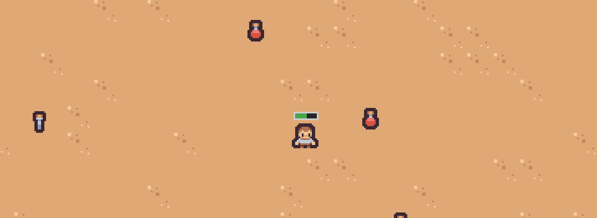

# Godot 4 Examples
A collection of useful Godot 4 examples for various types of games.

## [Custom Resource In Godot](./character-stats-example/README.md)

 Custom resources are useful for decoupling communications between nodes. In this example you can see how a characters "stats" are separated from the character itself. This allows the stats to exist outside of the character and be shared between other nodes in the project.
