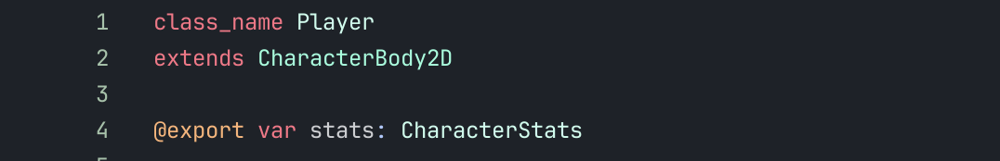

# Custom Resources
This example demonstrates the use of custom resources for decoupling communication between nodes. By using a custom resource `CharacterStats` we seperate the player from his stats. Any object only concerned with the stats does not need to know about the player. The stats can exist WITHOUT the character.

## Step 1: Create a resource type
Looking in the stats folder, you will see a `character_stats.gd` script file. This contains definitions for the types of data that can be tracked, and signals that can be emitted. This alone is not enough to do anything. You must create an "instance" of the resource.

## Step 2: Creating a resource instance
Because a custom `class_name` is provided at the top of the script, the resource can be created from the FileSystem menu. This is how the file `player_stats.tres` was created.

## Step 3: Set some custom values for the new resource
Now that a resource is created, you can view it in the inspector and update its default values. Any node that references this instance of CharacterStats will be referencing these same values.

## Step 4: Create a reference to this new resource.
Now that the resource is setup, you can reference it from your nodes once you set up some `@export` variables. _You can also reference through the file system so that no inspector is needed._

Assigned in the inspector

## Step 5: Create a reference from another node
Now we can assign the same reference to another node. Notice that by using this pattern we are not talking about the PLAYER, we are talking about the players' stats. The player does not need to exist to do work with the players stats. We have successfully decoupled the player object from his stats. This can be useful!

For example: We would like the Ui to flash any time the players move speed changes. We just let the ui listen to the players stats for this!

